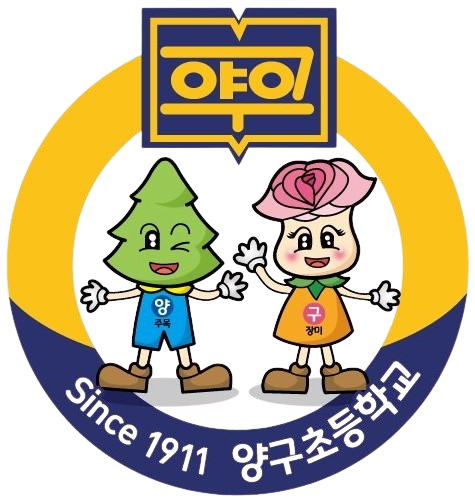

<!DOCTYPE html>
<html lang="ko">
<head>
<meta charset="UTF-8">
<meta name="viewport" content="width=device-width, initial-scale=1.0">
<title>공감 네컷 | 양구초등학교</title>
<meta name="description" content="양구초등학교 공감 네컷 - 손동작으로 공감을 표현하는 포토부스">

</head>
<body>

  <!-- HOME -->
  

    

      
    

    

      <h1>🌸 공감 네컷</h1>
      
우리 반, 서로를 응원하는 마음을 담아 찍어요

    

    

      <button class="btn btn-primary" onclick="goTo('screen-camera')">📸 사진 찍으러 가기</button>
      <button class="btn btn-ghost" onclick="goTo('screen-help')">❓ 사용 방법</button>
    

    
가로 2×2 그리드 프레임 · 총 4컷 연속 촬영 카메라 권한을 허용해주세요 · 손동작을 자동으로 인식해요

  

  <!-- HELP -->
  

    

      <h2 style="color:var(--coral); margin-top:0;">🫶 공감 네컷 사용방법</h2>
      
<b>1. 카메라 허용</b> 브라우저 상단에서 카메라 권한을 허용해주세요.

      
<b>2. 손동작으로 표현</b> 화면에 안내되는 순서대로 동작을 보여주면 자동으로 촬영돼요.

      <ul style="padding-left:18px; line-height:1.9;">
        <li>👍 엄지척 — 응원해요</li>
        <li>✌️ 브이 — 우리반 최고</li>
        <li>🤟 아이러브유(엄지·검지·새끼) — 사랑해요</li>
        <li>✋ 손바닥 펴기 — 함께해요</li>
      </ul>
      
<b>3. 촬영</b> 동작이 인식되면 5초 카운트다운 후 촬영, 총 4번 반복됩니다.

      

        
📌 인식이 잘 되려면

        <ul style="padding-left:18px; margin:0; line-height:1.8; font-size:14px;">
          <li>밝은 곳에서 촬영하세요 (역광 X)</li>
          <li>손과 얼굴이 화면에 크게, 뚜렷하게 나오도록 카메라에서 30~80cm 거리를 유지하세요</li>
          <li>동작을 취한 손 하나만 화면 중앙 쪽에 크게 보여주세요 (다른 손이나 다른 사람 손은 화면 밖으로)</li>
          <li>동작을 짧게 흔들지 말고 1~2초간 그대로 유지해주세요</li>
          <li>인식이 안 되면 화면의 안내 배너를 눌러서 다음 단계로 넘길 수 있어요</li>
        </ul>
      

      <button class="btn btn-secondary" onclick="goTo('screen-home')" style="margin-top:14px;">확인했습니다</button>
    

  

  <!-- CAMERA -->
  

    

      <button class="back" onclick="stopCameraAndGo('screen-home')">← 홈</button>
      
0 / 4

    

    

      💡 밝은 곳 · 손을 화면 중앙에 크게 · 30~80cm 거리 · 동작 1~2초 유지
    

    

      <video id="video" autoplay playsinline muted></video>
      <canvas id="overlayCanvas" class="overlay-canvas"></canvas>
      
🫶

      

      
3

      

    

    
손동작 인식을 준비하고 있어요…

    

      
👍 응원해요 동작을 보여주세요

      

    

    

      

    

    

      
👍응원해요

      
✌️우리반최고

      
🤟사랑해요

      
✋함께해요

    

    

      <button class="btn btn-secondary" onclick="resetShots()">다시 찍기</button>
      <button class="btn btn-primary" id="shootBtn" onclick="startBurst()">📷 촬영 시작</button>
    

  

  <!-- RESULT -->
  

    

      <button class="back" onclick="goTo('screen-home')">← 홈</button>
      
완성!

    

    
<canvas id="finalCanvas" width="800" height="800"></canvas>

    

      <button class="btn btn-secondary" onclick="retakeFromResult()">다시 찍기</button>
      <button class="btn btn-primary" id="downloadBtn">⬇️ 저장하기</button>
    

  

</body>
</html>
